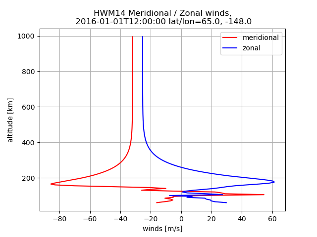

# HWM14 in Python

NASA Horizontal Wind Model HWM14 in Python &ge; 3.6




Works with many Fortran compilers, including:

* Gfortran &ge; 5
* Intel `ifort`
* PGI `pgf90`
* Nvidia `flang`


## Install

A Fortran compiler such as `gfortran` is needed.
We use `f2py` (part of `numpy`) to seamlessly use Fortran libraries from Python.
If you don't have a Fortran compiler, here is how to install Gfortran:

* Linux: `apt install gfortran`
* Mac: `brew install gcc`
* Windows
  * Install [MSYS2](https://www.msys2.org/)
  * pacman -S gfortran

Install HWM14 as an editable project:

`pip install -e .`

test by

    pytest -sv

### Windows
If you get ImportError on Windows for the Fortran module, try from the `hwm14` directory:
```posh
del *.pyd
python setup.py build_ext --inplace --compiler=mingw32
```

## Usage

HWM14 can be used from the command line or as an imported Python module in other programs.
Matlab also can use HWM14.

### Command line

    python RunHWM14.py -h

Write data to NetCDF (HDF5) with `-o` option.

### import module

```python
import hwm14
from datetime import datetime

winds = hwm14.run(t=datetime(2017,11,12,8), altkm=150.,
                    glat=65., glon=-148., f107a=150, f107=150, ap=4)
```

`winds` is an [xarray.Dataset](http://xarray.pydata.org/en/stable/generated/xarray.Dataset.html)

```
 <xarray.Dataset>
Dimensions:     (alt_km: 1)
Coordinates:
  * alt_km      (alt_km) float64 150.0
Data variables:
    meridional  (alt_km) float64 4.827
    zonal       (alt_km) float64 -20.5
Attributes:
    time:     2017-11-12T08:00:00
    glat:     65.0
    glon:     -148.0
```

If you want just a single variable, say
```python
print(winds.zonal.values)
```

### Matlab

You can import this Python module from Matlab as in `hwm14.m`.

## Notes

### [Optional] Fortran-only use

Most users don't need this.
```sh
meson build

meson test -C build
````

or

```sh
f2py -c src/hwm14.f90  -m hwm14 only: gws5 :
```


### Reference

Original A. E. Hedin Fortran 77 HWM93 [code](ftp://hanna.ccmc.gsfc.nasa.gov/pub/modelweb/atmospheric/hwm93/)
